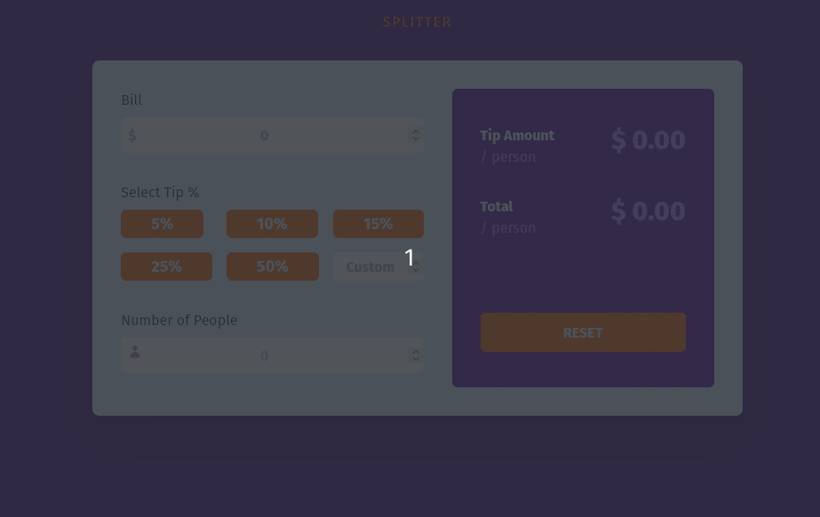
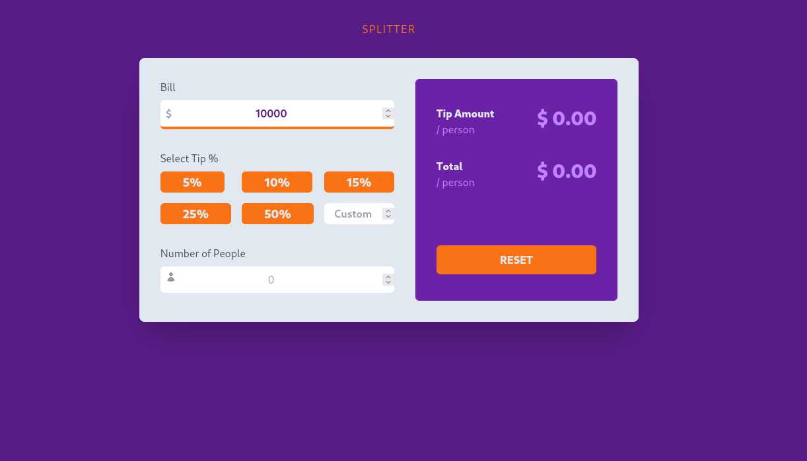
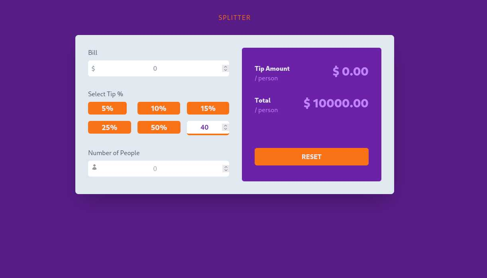
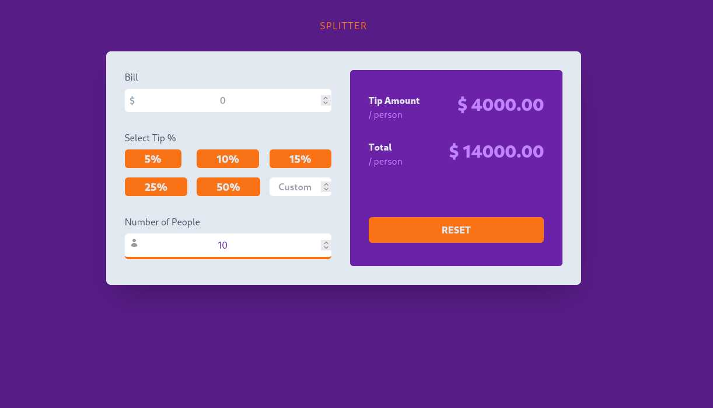
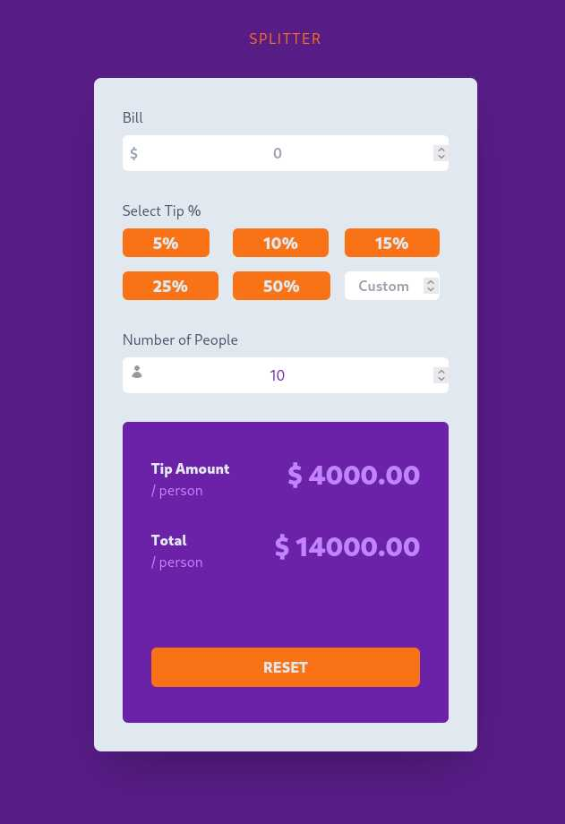
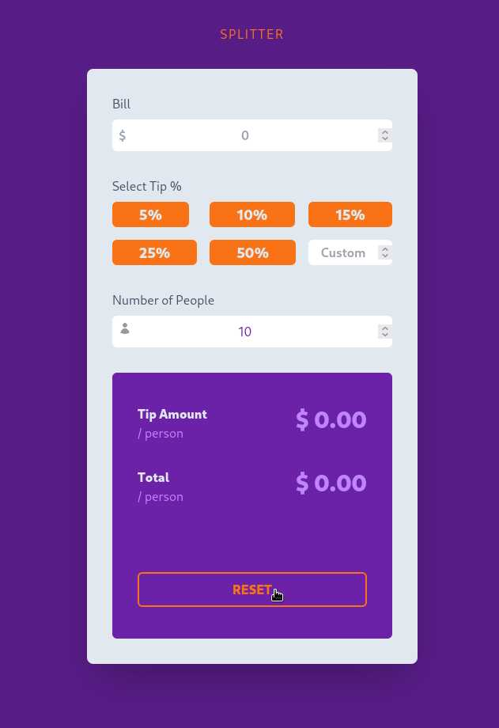

# Bill-Splitter

Split bills among friends with simple and easy to use App. React and Tailwind-CSS used to create the app.

---

# App Demo:

 

---

## Preview images:

 

### Bill-Input:

 

 

- Input total bill amount.
- Enter any number and any format.

 

### Decimal Support:

 

 

- The app supports decimal numbers and calculation.
- The result is displayed to two decimal point.

 

### Tip-Percentage:

 

1
 

- Easily input tip percentage with a click.
- To change Tip amount just press another option.

 

### Flexible-UI:

 

 

- The code is written using dynamic `CSS`. Making it extremely easy to add new additional themes and accent colors.
- UI looks and works great in different device size.

 
 

### Flexible-UI:

 

 

- Press RESET to start over again.

 
 

---

## Tech Stack Used:

 

  
  

  

---

## Link of deployed app:

TBA

---

## Profiles:
